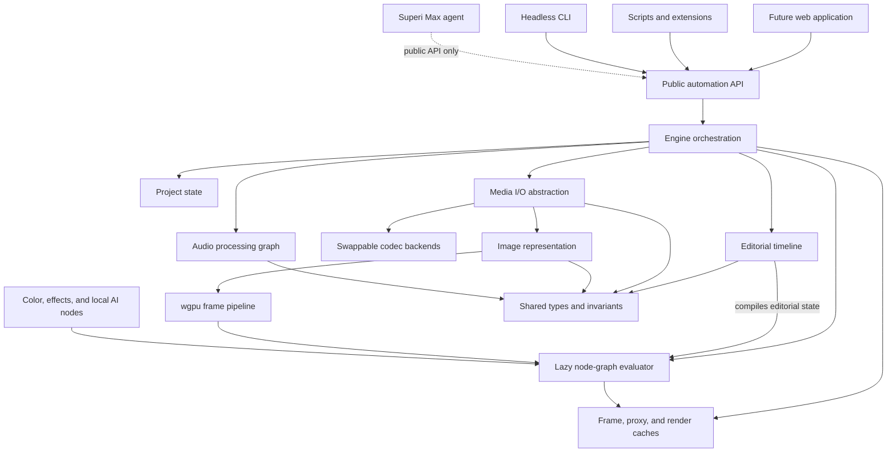

# Superi

**An open, professional post-production environment built around one programmable, GPU-native
engine. Superi Max is an optional generation and agent layer constructed across a hard architectural
boundary.**

> **Project status:** Superi is currently an architectural scaffold. The repository establishes the
> product boundaries, engine topology, crate dependency graph, codec isolation strategy, and build
> sequence before substantive engine implementation begins. It is not yet a functioning video editor.

Superi begins from a simple observation: professional post-production software has historically
separated editing, compositing, color, and audio into different applications, different internal
models, or different subsystems joined by increasingly elaborate seams. That fragmentation is
expensive for users and constraining for software architecture. An edit becomes a handoff; a
composite becomes a round trip; a grade becomes a separate representation of the same underlying
media; automation is forced to imitate user-interface actions because the editor itself was never
designed as a programmable system.

Superi is an attempt to construct the opposite: a complete, professional post-production
environment in which editorial structure, image synthesis, color processing, effects, audio, local
machine intelligence, persistence, and automation are different expressions of one coherent engine.
The open product is intended to be free, forkable, identity-free, and fully functional without a
network connection. A separate product, Superi Max, adds server-backed media generation and an
orchestrating agent without becoming a prerequisite for the editor beneath it.

This is an unusually ambitious project. DaVinci Resolve, Adobe Premiere Pro, and Adobe After Effects
represent decades of specialized engineering. Superi does not treat their combined surface area as
a short feature checklist, nor does it claim that a directory of empty modules constitutes progress
toward parity. The project instead begins by fixing the properties that become prohibitively
expensive to retrofit later: the render primitive, color representation, GPU residency, concurrency
model, codec boundary, timeline interchange posture, public automation surface, and the physical
separation between the open and proprietary products.

The current repository is the resulting set of bones.

---

## The destination

Superi is intended to become a professional environment in which a working editor can complete the
majority of real post-production projects without leaving the application. Its destination spans
four disciplines:

- **Editing:** a mature multitrack timeline, professional trimming semantics, multicamera editing,
  nested sequences, media management, relinking, proxies, optimized media, and dependable delivery.
- **Compositing and motion:** graph- and layer-oriented compositing, animation, expressions,
  masking, rotoscoping, tracking, text, motion design, transitions, and third-party effects.
- **Color:** scene- and display-referred color management, node-based grading, primary and secondary
  operations, scopes, LUTs, HDR, wide-gamut workflows, and correct display transforms.
- **Audio:** sample-accurate synchronization, multitrack editing, low-latency playback, buses,
  metering, fades, routing, automation, resampling, and professional plug-in hosting.

These are not conceived as four applications in a shared shell. They are four working modes over the
same project state and the same underlying computational substrate. The timeline is an editorial
representation of a graph. A grade is a graph operation. A transition is a graph operation. A mask
produced by a local model is an editable graph artifact. A script, the eventual graphical interface,
and the Superi Max agent all act through the same public command surface.

The honest definition of success is asymptotic rather than theatrical. Superi may never reach a
moment at which every checkbox accumulated by several mature products has been duplicated. The
meaningful threshold is reached when professionals can genuinely live in Superi for most projects,
choose it for its quality rather than merely its license, and regard its openness and programmability
as decisive advantages rather than compensations.

---

## Two products, separated physically

The name **Superi** refers to the open editor without qualification. It is not “Superi Free,”
“Superi Community,” or a reduced introductory tier. The name **Superi Max** refers to a separate,
additive product that supplies capabilities requiring hosted intelligence, third-party generation
models, accounts, and metered computation.

This naming discipline is important. Superi must be complete enough to stand proudly on its own;
Superi Max must read as a companion layer, not as the version in which the real product has been
withheld.

### Superi: open, local, and complete

Superi comprises the entire professional editor, its engine, its automation surface, and a bounded
set of local machine-learning conveniences. The open tree is designed to build and operate without
the proprietary tree present. It must require no Superi account, no license server, no credit
balance, and no remote service for core functionality.

The governing test is intentionally physical:

> Disconnect the network. Superi must still edit, composite, grade, mix, run its local AI tools,
> save and reopen projects, render, and export without degradation.

This test is stronger than a promise that the application “supports offline mode.” Offline operation
is not a fallback path. The open editor has no server-backed primary path from which it falls back.
The intended enforcement mechanism is a network-isolated continuous-integration workflow that fails
if open-tree functionality attempts to acquire a network dependency.

### Superi Max: generation and orchestration

Superi Max lives on the other side of that boundary. It contains two complementary products sharing
an account system and credit pool:

1. **Media generation:** explicit tools for generating audio, images, video, and *edit media*, including effects,
   transitions, animations, motion graphics, and templates that can be inserted into a project as
   ordinary assets.
2. **The agent:** a general orchestrator that can reason about a project, operate the editor through
   Superi's public automation API, use every generation tool available to a human, and, with granular
   permission, source material from the user's computer or the internet.

Media generation creates raw material that did not previously exist. The agent performs editorial
and post-production work that a human could perform: trimming, arranging, organizing, mixing,
grading, sourcing, applying effects, and deciding when generated material is appropriate. Generation
is therefore the deeper source of novel capability; the agent is both a substantial time-saving
product and the mechanism capable of orchestrating those generation tools across a complete edit.

Neither product receives a privileged engine backdoor. The agent drives the same open API used by
the graphical interface, scripts, extensions, and command-line clients. A generated clip becomes a
normal clip. An agent-created cut becomes a normal transaction. A generated mask becomes an editable
node. Once produced, those artifacts remain usable in Superi with the network disconnected and
Superi Max absent.

### The governing division

The durable line between the two products is conceptual, not merely a reflection of what current
hardware can run:

> **Transform or analyze what already exists: open and local.**
>
> **Generate what did not exist, or perform hosted general reasoning: Superi Max.**

Anchoring the boundary to the nature of the operation prevents it from drifting every time local
models improve. It also makes the open-source commitment legible: bounded transformations of a
user's own material belong to the editor; server-backed creation and general orchestration belong to
the optional commercial layer.

---

## Local intelligence as editable infrastructure

Superi's open AI surface is deliberately composed of bounded, local transformations rather than an
open-ended agent. Candidate capabilities include:

- transcription and automatic captions;
- audio denoising;
- silence detection and removal;
- filler-word detection;
- speaker diarization;
- background removal and subject masking;
- automatic reframing for alternate aspect ratios;
- scene and cut detection;
- object and face tracking;
- shot-to-shot color matching;
- content-based media search and tagging; and
- transcript-based editing.

Every shipped capability must satisfy three conditions. Its model must be permissively licensed and
redistributable; inference must run locally with no remote execution path; and the result must become
ordinary, inspectable, editable engine state. A segmentation model should produce a mask that can be
keyframed and refined. A color-matching operation should produce visible color operations. A
transcript edit should produce normal timeline transactions. Machine intelligence is not allowed to
create an opaque alternate state model that the rest of the editor cannot understand.

This editable-artifact principle is as important as offline execution. It preserves professional
control, makes model output reversible, allows human refinement, and prevents AI functionality from
becoming a parallel black-box editor embedded inside Superi.

---

## One graph beneath the application

The fundamental render primitive is a directed acyclic graph of operations. Nodes describe sources,
transforms, color operations, effects, composites, and outputs; edges describe the flow of typed
image data. The graph evaluator is intended to operate lazily by frame and by region, evaluating only
the portions of the graph necessary to satisfy a concrete output request.

The timeline is not an independent rendering subsystem. It is a high-level editorial model that
compiles into graph mutations. Trimming a clip changes the temporal mapping of source nodes. Adding a
transition constructs or modifies a subgraph. Applying a grade introduces color nodes. Nesting a
sequence creates compositional graph structure. This relationship is what permits editorial,
compositing, and color functionality to develop without multiplying mutually inconsistent render
paths.

The graph itself remains node-type-agnostic. It defines evaluation, mutation, serialization,
region-of-interest propagation, expressions, and node contracts; it does not depend on the color or
effects catalogs built on top of it. Capabilities depend downward on the graph. The graph does not
depend upward on every capability Superi may someday acquire.



---

## The frame pipeline

Superi's internal image pipeline is designed around three commitments that are difficult to add
after an engine has already been built.

### GPU residency

Decoded frames are uploaded to GPU memory and remain resident through graph evaluation. Effects,
compositing, resampling, and color operations are expected to execute without repeated CPU/GPU round
trips. Readback is reserved for operations that genuinely require CPU-visible output, principally
encoding and thumbnail generation.

This is not simply a performance optimization. Residency influences the ownership model of frames,
the cache architecture, node interfaces, synchronization strategy, memory-pressure behavior, and the
division between image metadata and image storage.

### Linear, high-bit-depth color

The internal working representation is linear and 16-bit floating point. Source material is
transformed from its native encoding into the working space, processed there, and transformed to an
appropriate display or delivery space at the boundary. The engine must not quietly assume that
incoming media, working media, and displayed media are all 8-bit sRGB images.

The intended color subsystem encompasses configurable color-management rules, source transforms,
view and display transforms, HDR transfer functions, wide-gamut operation, LUT application, and
display-profile awareness. These responsibilities are being modeled as Rust-native infrastructure
rather than as UI-specific corrections.

### Caching as architecture

Responsive professional playback is not obtained through raw computation alone. Superi treats final
frame caching, intermediate-node caching, proxy generation, optimized-media substitution,
background rendering, prefetching, eviction, and disk persistence as first-class engine concerns.
Caching participates in graph invalidation and memory arbitration; it is not an unstructured map
added after playback becomes slow.

---

## Determinism, concurrency, and orchestration

The engine is headless by design. Given the same project state, source media, render configuration,
and frame request, evaluation through a CLI or continuous-integration runner must be equivalent to
evaluation requested by the eventual graphical application. UI state is never allowed to become a
hidden render input.

Rust is used not merely as an implementation language but as part of the concurrency strategy. The
engine will coordinate independent playback, render, decode, audio, GPU-submission, and application
control paths while relying on explicit ownership and `Send`/`Sync` constraints rather than treating
shared mutable state as an informal convention. `unsafe` Rust is permitted only at genuine GPU and
foreign-function boundaries, where it must be narrowly isolated and justified.

Individual subsystems do not by themselves constitute an engine. The orchestration layer must bind
them into coherent operations:

- playback combines decoding, graph evaluation, caches, audio, and a master clock;
- export combines decoding, graph evaluation, color conversion, readback, encoding, and queueing;
- transactions coordinate timeline, graph, cache, persistence, undo, and API events;
- resource arbitration balances decode buffers, CPU images, GPU allocations, and caches;
- lifecycle management initializes and tears down shared devices and subsystem state;
- error propagation must surface failures without corrupting a project or deadlocking playback; and
- introspection must report what a particular build can actually open, process, display, and deliver.

This connective tissue is engine code, not UI assembly. It is expected to be among the most difficult
and failure-prone work in the project.

---

## The application boundary

The graphical application is expected to use web technology in a native desktop host, communicating
with the Rust engine through the public automation API. That direction gives Superi access to a
mature interface ecosystem and a large design and engineering talent pool while keeping the
performance-critical media pipeline native and GPU-driven.

The UI is responsible for presenting timelines, panels, inspectors, node graphs, scopes, meters,
project organization, and interaction. It is not responsible for secretly reimplementing editing
semantics, graph mutation, color math, persistence, or render logic. A ripple edit initiated by a
pointer gesture and the same ripple edit initiated by a script must ultimately become the same engine
command.

A custom GPU-rendered UI remains possible in a distant future because the engine already speaks
wgpu, but building a complete UI framework, including layout, typography, accessibility, internationalization,
text input, docking, and widget behavior, is deliberately outside the present destination. Web
technology is the current primary direction; final application-shell and transport details remain
subject to validation by the founding engineering team.

---

## Media I/O and the codec boundary

Codec support is both an engineering problem and a distribution constraint. Superi therefore does
not allow the engine core to call a particular codec implementation directly. `superi-media-io`
defines codec-agnostic operations such as requesting a frame from a source or submitting frames to an
encoder. Concrete backends register behind those interfaces.

The intended default build uses in-tree, permissively licensed implementations for royalty-free or
otherwise clean formats. A separate optional backend, enabled through the `os-codecs` feature,
provides access to platform facilities for formats that cannot safely become direct dependencies of
the MIT core. Still images and image sequences are handled by the image subsystem rather than being
conflated with video codec backends.

This repository does not claim that the unresolved legal and patent landscape can be solved by a
clever Cargo feature. The exact treatment of encumbered formats, the production-readiness and license
posture of candidate codec implementations, and the cross-platform coverage of OS facilities remain
explicit review items. The architectural invariant is narrower and non-negotiable: the MIT core must
not directly import or link GPL or patent-encumbered codec implementations.

See [`docs/codecs.md`](docs/codecs.md) for the current policy and format matrix.

---

## The current scaffold

The `open/` directory is a Cargo workspace containing eighteen crates. The workspace is intentionally
organized as one crate per major responsibility, with dependencies pointing downward through an
acyclic hierarchy. The crate graph is meant to make architectural violations visible to the Rust
compiler rather than leaving them entirely to documentation and code review.

At present these crates are primarily declarative. Their manifests establish package relationships,
and their source files identify module ownership and intended responsibilities. Most modules contain
documentation stubs rather than types, algorithms, or production behavior. The only executable
behavior is a CLI scaffold that prints its version. No external workspace dependency has yet been
activated by engine implementation.

That sparseness is deliberate, but it should not be mistaken for a completed foundation. The scaffold
answers:

- Where does a capability belong?
- Which lower-level contracts may it depend on?
- Which boundaries must it never cross?
- Where will integration occur?
- Which surfaces must remain public and stable?

It does not yet answer how decoding, graph evaluation, color transformation, playback, persistence,
or editing will actually be implemented.

### Crate hierarchy

| Tier | Crate | Responsibility |
|---|---|---|
| T0 | `superi-core` | Shared errors, identifiers, rational time, geometry, pixel and color tags, diagnostics, and settings. |
| T1 | `superi-image` | High-bit-depth image model, channels, metadata, CPU operations, tiling, and image I/O. |
| T1 | `superi-gpu` | wgpu devices, buffers, textures, uploads, conversions, shaders, passes, memory pools, and readback. |
| T1 | `superi-concurrency` | Job scheduling, execution paths, GPU submission, playback clocks, and shared-state conventions. |
| T1 | `superi-media-io` | Codec-independent decode/encode contracts, demuxing, timecode, image sequences, audio streams, and backend registration. |
| T1b | `superi-codecs-rs` | Default permissive codec backend and its registration surface. |
| T1b | `superi-codecs-platform` | Optional platform codec backend behind the `os-codecs` feature and isolated FFI boundaries. |
| T1b | `superi-codecs-vendor` | Host protocol and process adapter for explicitly selected, separately installed vendor RAW workers. |
| T2 | `superi-graph` | Node DAG, typed contracts, lazy evaluation, mutation, serialization, regions of interest, expressions, and headless execution. |
| T2 | `superi-cache` | Frame and intermediate caches, proxies, background render caching, prefetch, eviction, and disk persistence. |
| T3 | `superi-color` | Linear working space, input/output transforms, configuration, views, HDR, LUTs, and display profiles. |
| T3 | `superi-effects` | Effect-node authoring, animation, masks, transitions, tracking, text, and future OFX compatibility. |
| T3 | `superi-timeline` | Rust-native editorial model, OTIO interchange, edit operations, markers, multicam, nesting, and graph compilation. |
| T3 | `superi-audio` | Audio graph, synchronization, playback, mixing, resampling, metering, and plug-in hosting. |
| T3 | `superi-ai` | Offline inference, editable AI artifacts, model auditing, and the bounded local transformation pipelines. |
| T4 | `superi-project` | Project document, whole-state persistence, autosave, and crash recovery. |
| T4 | `superi-engine` | Playback and export orchestration, transactions, lifecycle, errors, resources, built-in nodes, queues, introspection, validation, and plug-ins. |
| T5 | `superi-api` | Stable public commands, events, scripting, versioning, and the unified automation surface. |
| T6 | `superi-cli` | First headless API consumer and eventual vertical-slice harness. |

The defining dependency rule is that lower tiers do not learn about the capabilities assembled above
them. In particular, `superi-graph` never depends on `superi-color` or `superi-effects`; node
catalogs depend on the generic graph. `superi-api` is deliberately separate from
`superi-engine`; the engine is internal orchestration, while the API is the stable facade consumed
by the UI, scripts, extensions, CLI, and Superi Max.

### Repository layout

```text
superi/
├── README.md                 Public project and scaffold orientation
├── LICENSE                   MIT license text
├── docs/
│   ├── architecture.md       Full engineering decisions and rationale
│   ├── north-star.md         Product destination and two-tier definition
│   ├── phases.md             Build sequence and subsystem inventory
│   └── codecs.md             Codec policy and format matrix
├── open/
│   ├── Cargo.toml            Eighteen-crate workspace definition
│   ├── Cargo.lock            Generated internal dependency graph
│   ├── deny.toml             Permissive-license allowlist
│   ├── rust-toolchain.toml   Stable Rust, rustfmt, and Clippy
│   ├── rustfmt.toml          Formatting policy
│   ├── docs/STRUCTURE.md     Compact crate topology and ownership map
│   └── crates/               Open engine packages
└── closed/
    └── README.md             Superi Max boundary notice
```

The `closed/` directory contains a boundary notice only. No Superi Max implementation is present.
Similarly, there is no application/UI tree yet.

---

## Building the scaffold

The open engine workspace requires stable Rust with rustfmt and Clippy. The pinned minimum Rust
version in workspace metadata is 1.80.

```bash
cd open
cargo build --workspace
cargo test --workspace
cargo clippy --workspace --all-targets -- -D warnings
```

Run the current CLI scaffold:

```bash
cargo run -p superi-cli
```

It currently prints:

```text
superi 0.0.0: scaffold (no engine yet)
```

Compile the opt-in platform codec path:

```bash
cargo build -p superi-cli --features os-codecs
cargo test -p superi-cli --features os-codecs
cargo clippy -p superi-cli --all-targets --features os-codecs -- -D warnings
```

The existence of successful builds at this stage proves that the package topology and feature
propagation are coherent. It does not prove codec functionality or any higher-level engine behavior,
because those implementations do not yet exist.

---

## The first executable thread

The first meaningful milestone is intentionally narrow:

> **Import a clip → place it on a single-track timeline → trim it → apply one graph effect → export.**

This is not intended as a disposable demonstration. Every step must pass through the architecture
that the finished editor will use: the real media-I/O abstraction, image representation, GPU upload,
linear working space, graph evaluator, timeline compiler, cache, engine transaction model, public
API, and export path.

The vertical slice is a continuous integration instrument. It prevents the team from spending years
constructing individually plausible libraries whose contracts have never been exercised together.
Components are built in dependency order, but they are pulled into a running end-to-end thread as
soon as they exist. Integration is therefore continuous; the later orchestration phase deepens and
hardens integration rather than initiating it.

---

## Build sequence

The project uses two complementary planning lenses. The numbered phases describe how engineering work
is sequenced. Capability stages describe what the application becomes once a proven engine exists.

### Phase 0: foundations and decisions

Define the north star, lock the technology and licensing boundaries, establish the subsystem
topology, identify unresolved human decisions, and make the vertical slice concrete enough to guide
implementation. The present repository belongs to this phase.

### Phase 1: engine components with continuous integration

Implement the Rust-native substrate in dependency order: shared primitives, image representation,
GPU infrastructure, concurrency, media I/O, codec backends, graph evaluation, caching, color,
effects, timeline, audio, local AI, and persistence. Each subsystem is exercised by the vertical
slice rather than developed in total isolation.

### Phase 2: orchestration and integration

Harden the running components into a coherent headless engine. Complete playback, export, A/V sync,
transactions, undo routing, lifecycle, recovery, resource arbitration, introspection, and the public
API. The exit state is an integrated engine that can be driven without a graphical interface and has
already been exercised through real consumers.

### Phase 3: the application and professional capability progression

Build the visual editor against the public API. The initial public-quality capability is a
professional timeline editor with dependable media management, proxies, playback, trimming, basic
color, multitrack audio, export, and a focused local-AI set. Compositing and motion, advanced color,
professional audio depth, and deeper local intelligence are then layered onto the same engine rather
than introduced as independent applications.

### Phase 4: private testing, optimization, and finalization

Exercise real projects, formats, devices, session lengths, plug-ins, displays, and failure modes.
Refine performance, stability, recovery, interaction quality, and cross-platform behavior. This is
hardening against the disorder of real production, not the first time subsystems are tested together.

### Phase 5: public open-source launch

Release Superi as a genuinely usable MIT post-production environment and begin the longer life of an
open professional tool: community development, ecosystem growth, compatibility expansion, and
continuous movement toward the north star.

See [`docs/phases.md`](docs/phases.md) for the expanded plan.

---

## Architectural invariants

Some properties are not implementation preferences. They are the conditions under which this project
remains Superi:

1. **The open tree stands alone.** It must build and operate without any proprietary source,
   account, service, credit system, or generation model.
2. **Dependency direction is one-way.** Superi Max may depend on Superi's public API; Superi may
   never depend on Superi Max.
3. **Codec implementations remain isolated.** The MIT core may not directly import or link GPL or
   patent-encumbered codec components.
4. **AI output is ordinary editor state.** Models produce editable masks, nodes, media, metadata, or
   timeline transactions; not opaque project state.
5. **The graph is the render primitive.** New visual capabilities become node types or compositions
   of node types, not alternative render engines.
6. **The timeline compiles downward.** Editorial operations modify a Rust-native model and its graph
   representation; the UI does not own edit semantics.
7. **Internal color remains linear and high precision.** Eight-bit display assumptions cannot leak
   into the working pipeline.
8. **Frames remain GPU-resident.** CPU readback occurs only at explicit boundaries.
9. **Headless and interactive evaluation are deterministic.** The UI cannot become a hidden render
   dependency.
10. **Concurrency is designed, not improvised.** Playback, rendering, audio, GPU submission, jobs,
    and application control respect explicit ownership and scheduling boundaries.

These rules are developed in [`docs/architecture.md`](docs/architecture.md) and
[`docs/codecs.md`](docs/codecs.md).

---

## Explicitly unresolved questions

Serious architecture documents should record uncertainty rather than laundering it into confidence.
Several decisions require additional technical, legal, or empirical validation:

- the exact legal and distribution posture for each codec family;
- the production readiness and complete license posture of candidate permissive codec libraries;
- the precise mechanism for faithful OTIO interchange;
- the final web application shell and engine transport;
- the detailed device-loss, GPU-memory, and multi-adapter strategy;
- the model runtime and redistribution audit for each proposed local AI capability;
- the Superi Max permission model for filesystem and internet access;
- the rights treatment of media sourced by an agent;
- the metering model for agent tasks that may themselves invoke generation; and
- Superi's visual identity, which is intentionally not defined by the engineering scaffold.

These are not invitations to guess. They are named decision surfaces that should be closed by the
appropriate expertise before the work they govern hardens.

---

## What is not in this repository yet

The present scaffold does **not** contain:

- working decode or encode implementations;
- a GPU device, shader library, or frame-processing pipeline;
- timeline data structures or editing operations;
- a functional graph or evaluator;
- color transforms or grading operations;
- playback or export orchestration;
- project serialization;
- audio processing;
- local model inference;
- the network-isolated and license-audit CI rails;
- the web application or native shell;
- Superi Max services, generation integrations, accounts, credits, or agent; or
- a public release.

The repository is intentionally honest about that state. Architectural foresight is valuable only if
it remains distinguishable from implementation evidence.

---

## Further reading

- [`docs/north-star.md`](docs/north-star.md) defines the destination and the Superi/Superi Max
  relationship.
- [`docs/architecture.md`](docs/architecture.md) records the full engineering rationale, accepted
  costs, rejected alternatives, and unresolved decisions.
- [`docs/phases.md`](docs/phases.md) contains the canonical build sequence and complete subsystem
  inventory.
- [`docs/codecs.md`](docs/codecs.md) describes the codec abstraction, format targets, and current
  licensing policy.
- [`open/docs/STRUCTURE.md`](open/docs/STRUCTURE.md) is the concise guide to the Cargo dependency
  hierarchy and proposed subsystem ownership.

---

## Why Superi

The long-term proposition is not merely that an existing category should have another entrant. It is
that a flagship post-production environment can be open without being incomplete, programmable
without being unsafe, intelligent without becoming opaque, and commercially extensible without
making its open foundation dependent on the commercial layer.

Superi is the editor: local, scriptable, inspectable, and owned by its users. Superi Max is the
optional ability to create missing material and delegate work to hosted intelligence. The boundary
between them is not a pricing-page distinction. It is embedded in the source topology, API direction,
runtime assumptions, artifact model, and tests the project intends to enforce.

That is the idea this scaffold exists to protect while the implementation begins.
